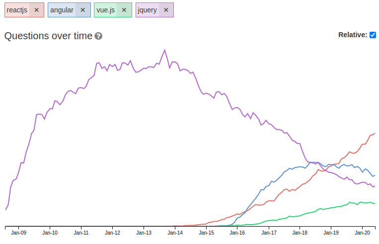

# From Python to JavaScript

My findings while learning modern JavaScript.

I learned Python in the year 2001 which is now roughly 20 years ago.

I still think Python is a very good choice, I would choose if over C, C++ or Java because it is so easy and lightweighted.

Up to now there is no established way to run Python in the browser.

During the last days a looked at the [Guide of the main concepts of React](https://reactjs.org/docs/hello-world.html) and like it very much. Wow, React is simple and pragmatic, but not dirty like PHP. I  well structured, too. 

The StackoverFlow TagTrend makes it obvious. JQuery is dead and React the leading JavaScript Library:

Source: [React, Angular, Vue, Jquery TagTrend](http://sotagtrends.com/?tags=reactjs+angular+vue.js)

